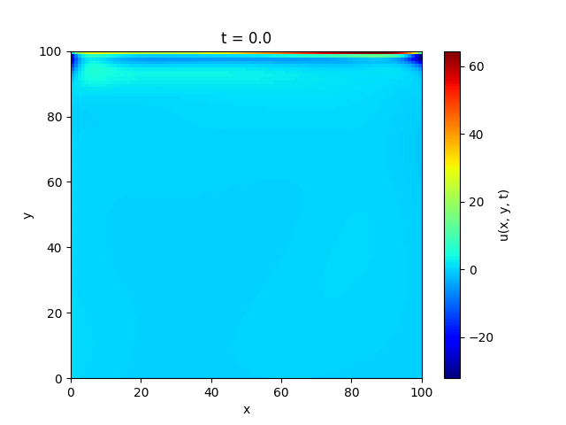

# Simulation of heat propagation using Physics-informed Neural Network

This project applies Physics-informed Neural Networks (PINNs) to simulate heat propagation, comparing it with the traditional finite difference method. It demonstrates PINNs' capability in solving the heat equation PDE given certain boundary and initial conditions. The comparison is visually represented through GIFs in the README, showcasing the effectiveness of PINNs in modeling thermal dynamics. This project also explores the use of PINN for PDE discovery by learning the thermal diffusivity (alpha) of materials, showcasing its potential in identifying unknown parameters in physical laws.

### Examples

| Finite difference method | Physics-informed Neural Network |
| :---: | :---: |
|  |  |

### Setup

```
python -m venv venv
source venv/bin/activate
pip install -r requirements.txt
```

Code examples and neural network training is located in `main.ipynb` notebook.

### References

- [M. Raissi, et al., Physics Informed Deep Learning (Part I): Data-driven Solutions of Nonlinear Partial Differential Equations, arXiv: 1711.10561](https://arxiv.org/abs/1711.10561)
- [M. Raissi, et al., Physics Informed Deep Learning (Part II): Data-driven Discovery of Nonlinear Partial Differential Equations, arXiv: 1711.10566](https://arxiv.org/abs/1711.10566)
- [Cai, S., Wang, Z., Wang, S., Perdikaris, P., and Karniadakis, G. E. (April 21, 2021). "Physics-Informed Neural Networks for Heat Transfer Problems." ASME. J. Heat Transfer. June 2021; 143(6): 060801](https://doi.org/10.1115/1.4050542)
- [Hubert Baty. A hands-on introduction to Physics-Informed Neural Networks for solving partial differential equations with benchmark tests taken from astrophysics and plasma physics. 2024. ffhal04491808f](https://hal.science/hal-04491808/file/pinnsf.pdf)